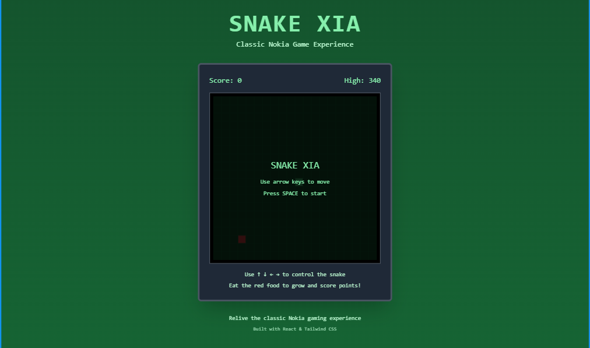

# Snake XIA - Classic Nokia Snake Game

<p align="center">
  
</p>

A classic Snake game recreation built with [Next.js](https://nextjs.org/), [TailwindCSS](https://tailwindcss.com/) and [ShadCN](https://ui.shadcn.com). Experience the nostalgic Nokia-style gameplay with modern web technologies.

## Features

- 🐍 Classic Snake gameplay mechanics
- 🎮 Retro Nokia-style green monochrome design
- 📱 Mobile-friendly touch controls
- 🏆 Score tracking with high score persistence
- ⌨️ Keyboard controls (Arrow keys + Spacebar)
- 🎯 Smooth 150ms movement interval

## How to Play

- Use **Arrow Keys** to control the snake direction
- Press **Spacebar** to start the game or restart after game over
- Eat the red food to grow your snake and increase your score
- Avoid hitting walls or your own tail!

## Getting Started

First, run the development server:

```bash
npm run dev
# or
yarn dev
# or
pnpm dev
# or
bun dev
```

Open [http://localhost:3000](http://localhost:3000) in your browser to start playing!
